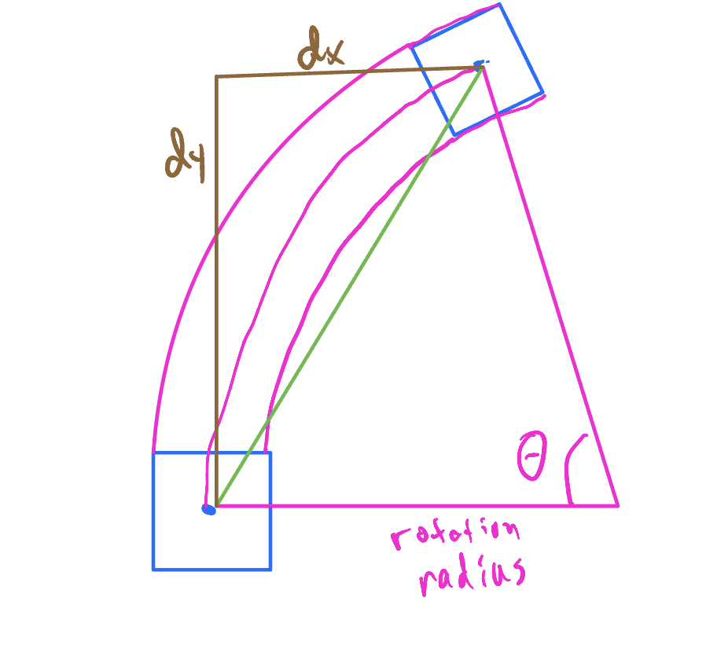

# Tank Drive Kinematics

In this assignment you are expected to write a program that given the following inputs:

* Drive Base width 
* Left drive velocity (m/s)
* Right drive velocity (m/s)
* time step (s)

Determines the change in the horizontal and vertical position of the center of your robot, if we assume the velocity is
constant velocity throughout the time step.

Imagine that your robot is square. 
Use the information from class to create the program.

